# DNS Model

The high level sequence diagram
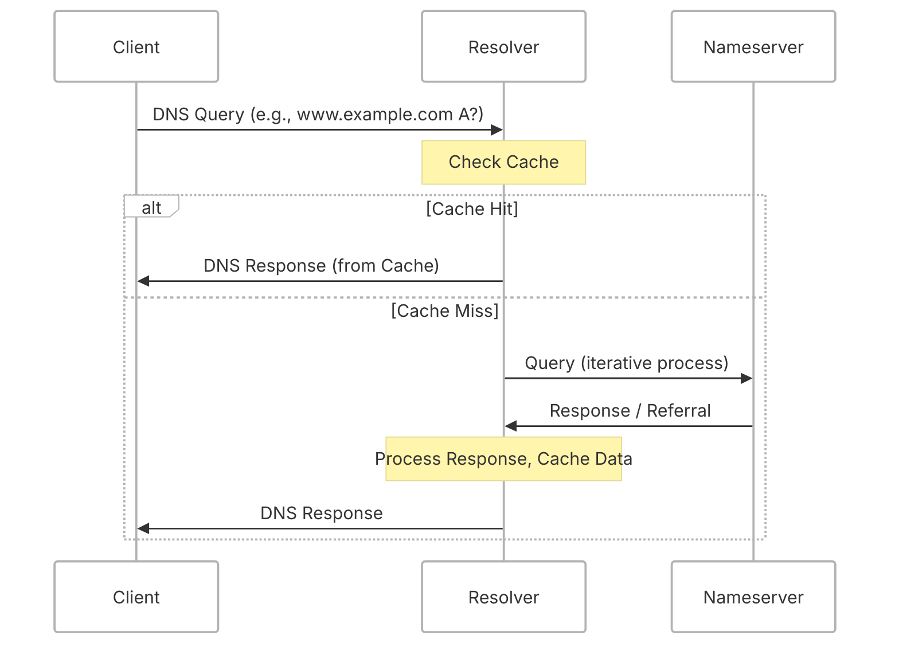

## DNS Resolver

High level state machine
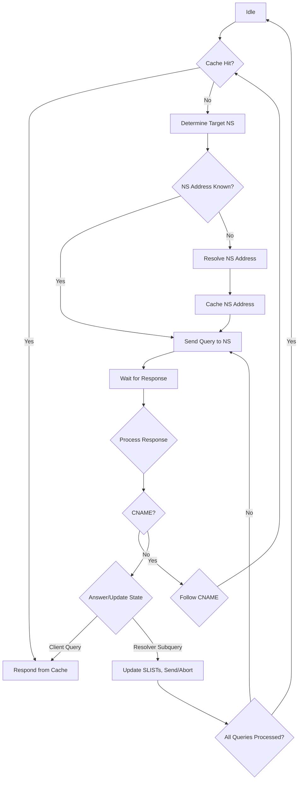

Cache check state machine
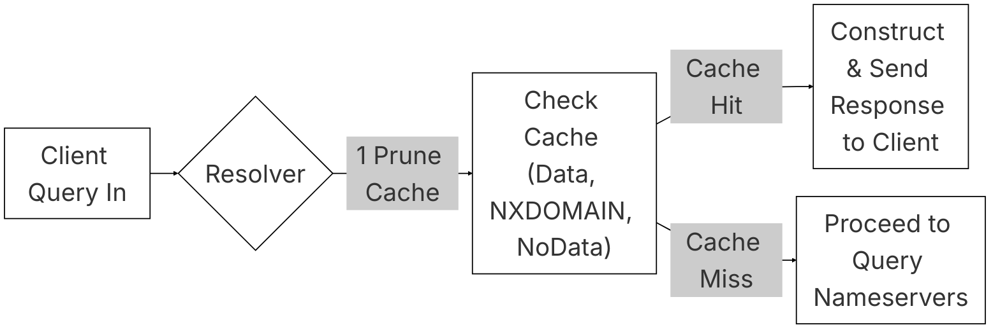

Cache miss state machine
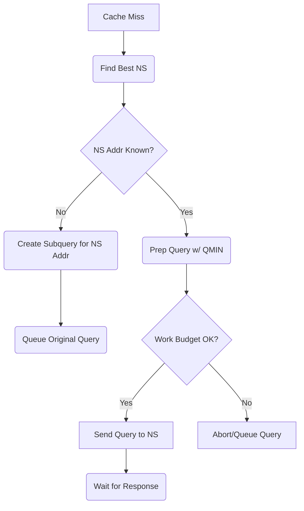

## Nameserver

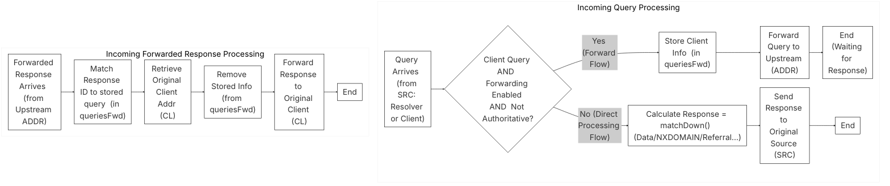

## Scheduler 

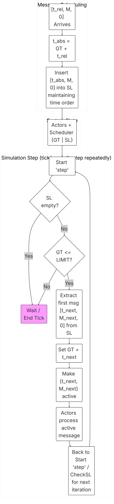

# Iodine Model

Sequence diagram summarizing all the interactions

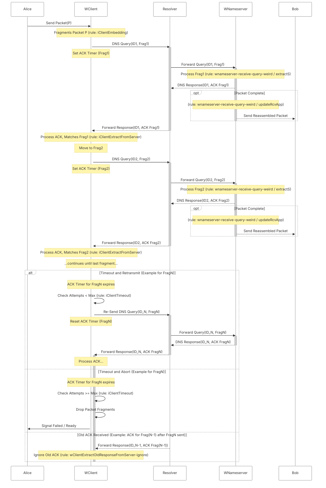

## Iodine server

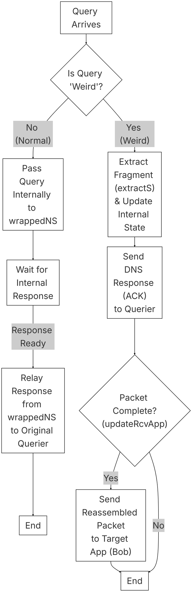

## Iodine client

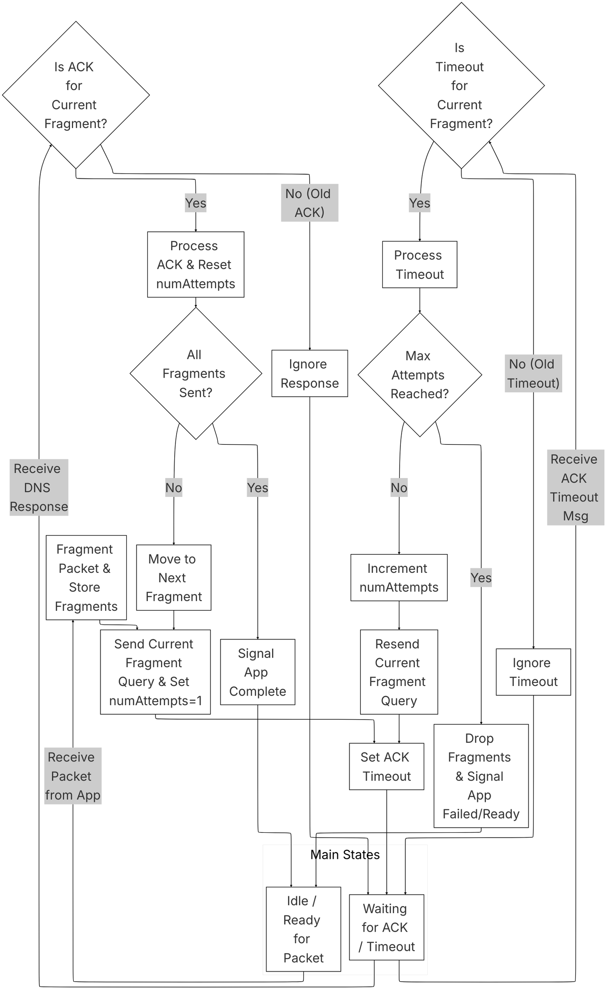
## Send app (Alice)

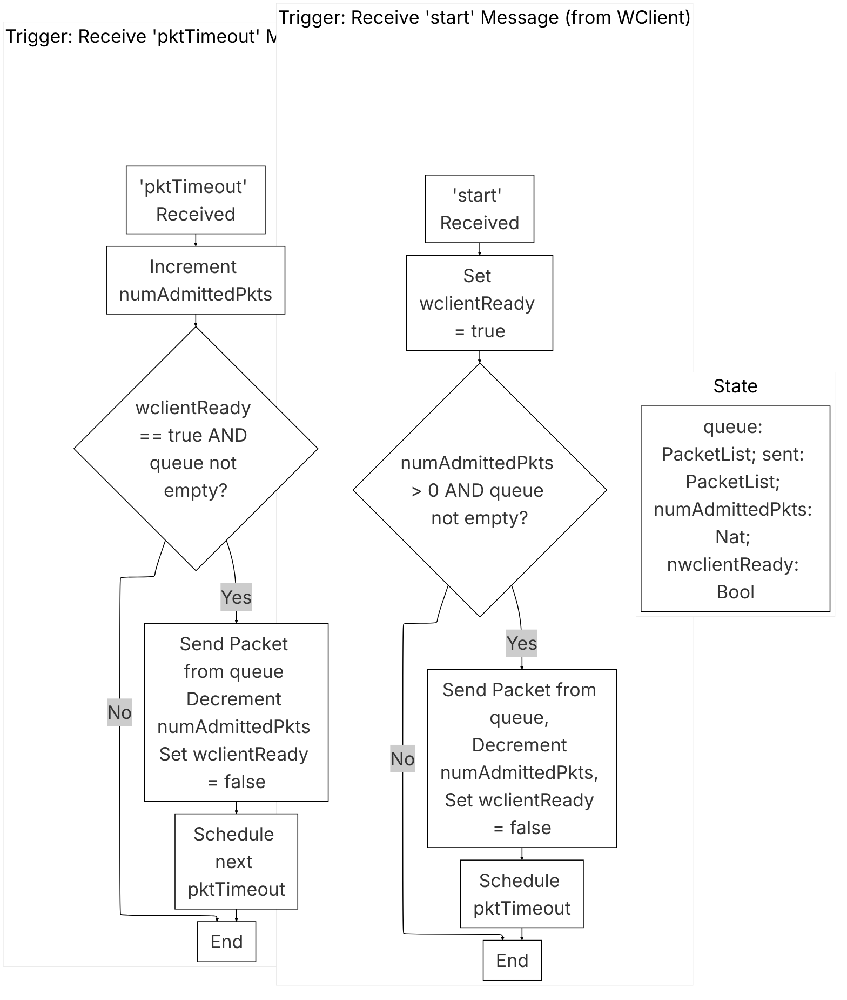

## Receive App

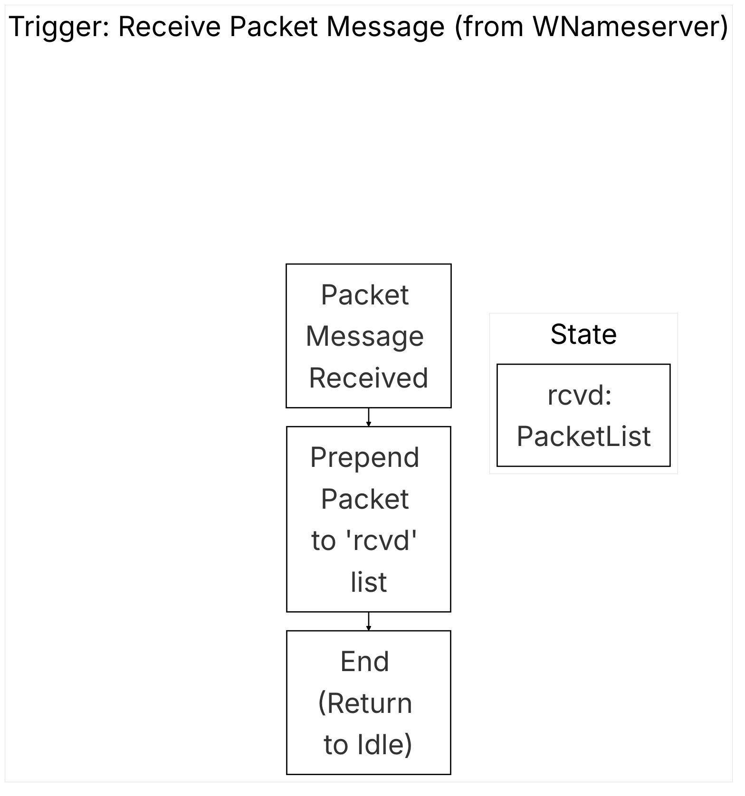