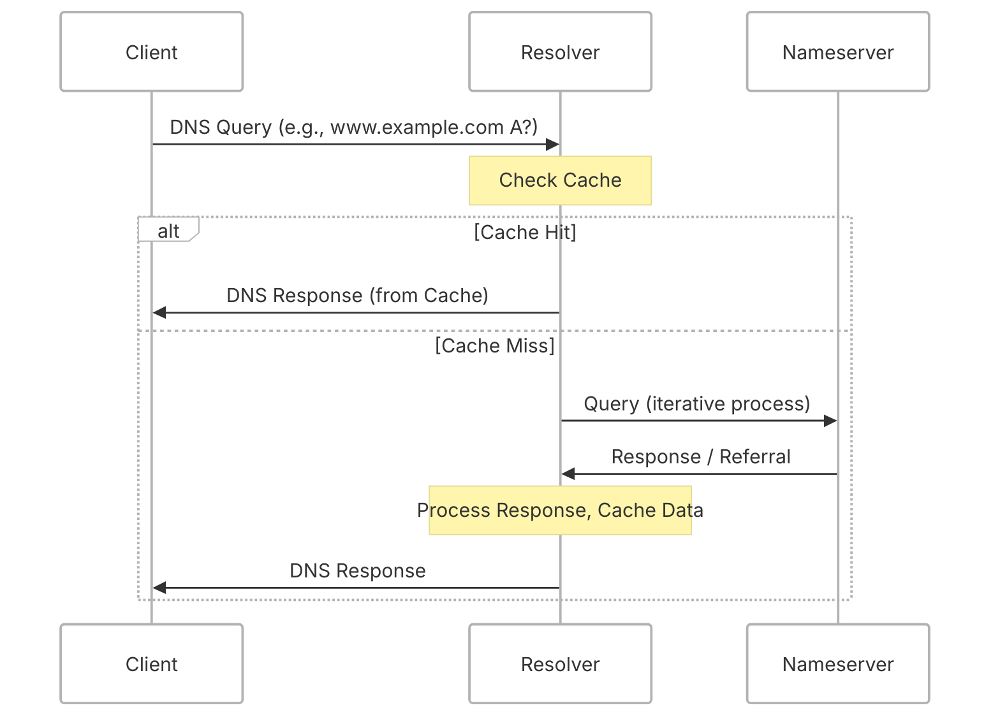
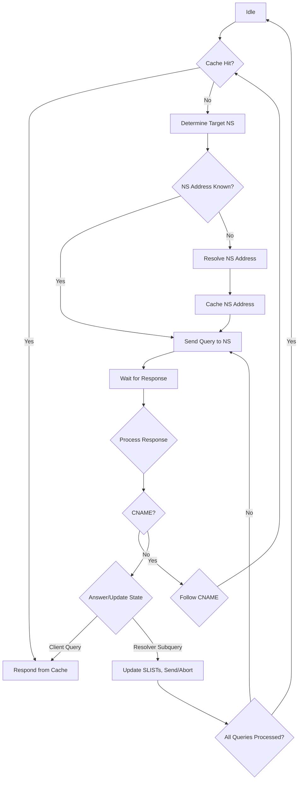
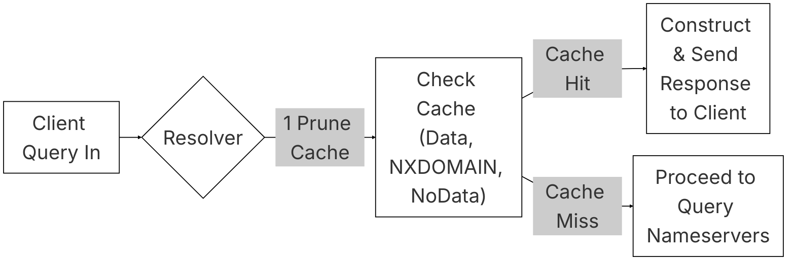
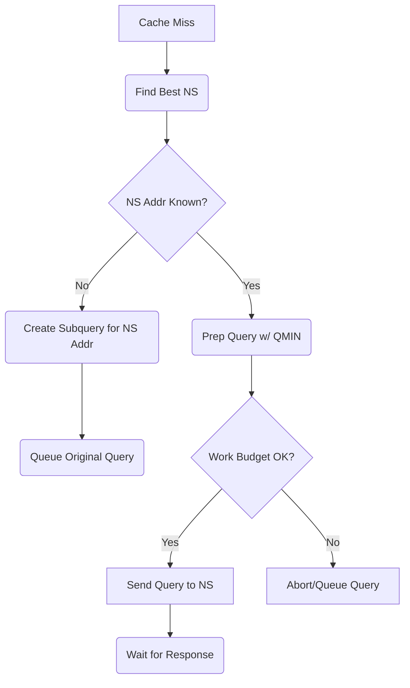
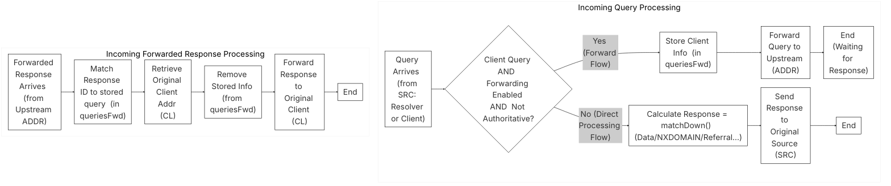
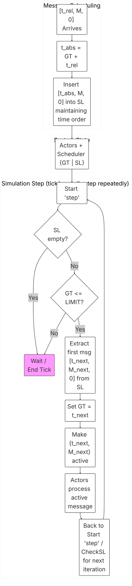

# DNS Model

The high level sequence diagram

```mermaid
%%{init: {'theme': 'neo', 'themeVariables': { 'fontSize': '44px', 'fontFamily': 'Inter'}}}%%
sequenceDiagram
    participant C as Client
    participant R as Resolver
    participant NS as Nameserver

    C->>R: DNS Query (e.g., www.example.com A?)
    Note over R: Check Cache
    alt Cache Hit
        R->>C: DNS Response (from Cache)
    else Cache Miss
        R->>NS: Query (iterative process)
        NS->>R: Response / Referral
        Note over R: Process Response, Cache Data
        R->>C: DNS Response
    end
```

## DNS Resolver

High level state machine

```mermaid
graph TD
    A[Idle] --> B{Cache Hit?}
    B -- Yes --> C[Respond from Cache]
    B -- No --> D[Determine Target NS]
    D --> E{NS Address Known?}
    E -- Yes --> F[Send Query to NS]
    E -- No --> G[Resolve NS Address]
    G --> H[Cache NS Address] --> F[Send Query to NS]
    F --> I[Wait for Response]
    I --> J{Process Response}
    J --> K{CNAME?}
    K -- Yes --> L{Follow CNAME}
    L --> B{Cache Hit?}
    K -- No --> M{Answer/Update State}
    M -- Client Query --> C[Respond from Cache]
    M -- Resolver Subquery --> N[Update SLISTs, Send/Abort]
    N --> O{All Queries Processed?}
    O -- Yes --> A[Idle]
    O -- No --> F[Send Query to NS]
```

Cache check state machine

```mermaid
%%{init: {'theme': 'neo', 'themeVariables': { 'fontSize': '44px', 'fontFamily': 'Inter'}}}%%
graph LR
    A[Client Query In] --> B{Resolver};
    B -- "1 Prune Cache" --> C["Check Cache (Data, NXDOMAIN, NoData)"];
    C -- Cache Hit --> D[Construct & Send Response to Client];
    C -- Cache Miss --> E[Proceed to Query Nameservers];
```

Cache miss state machine

```mermaid
graph TD
    A[Cache Miss] --> B(Find Best NS);
    B --> C{NS Addr Known?};
    C -- Yes --> D(Prep Query w/ QMIN);
    C -- No --> E(Create Subquery for NS Addr);
    E --> F(Queue Original Query);
    D --> G{Work Budget OK?};
    G -- Yes --> H[Send Query to NS];
    G -- No --> I[Abort/Queue Query];
    H --> J(Wait for Response);
```

## Nameserver

```mermaid
%%{init: {'theme': 'neo', 'themeVariables': { 'fontSize': '44px', 'fontFamily': 'Inter'}}}%%
graph TD
    subgraph "Incoming Query Processing"
        A["Query Arrives  (from SRC: Resolver or Client)"] --> B{"Client Query AND  Forwarding Enabled AND  Not Authoritative?"};
        B -- "Yes (Forward Flow)" --> C["Store Client Info  (in queriesFwd)"];
        C --> D["Forward Query to Upstream (ADDR)"];
        D --> E["End (Waiting for Response)"];

        B -- "No (Direct Processing Flow)" --> F["Calculate Response = matchDown()  (Data/NXDOMAIN/Referral...)"];
        F --> G["Send Response to Original Source (SRC)"];
        G --> H["End"];
    end

    subgraph "Incoming Forwarded Response Processing"
        I["Forwarded Response Arrives  (from Upstream ADDR)"] --> J["Match Response ID to stored query  (in queriesFwd)"];
        J --> K["Retrieve Original Client Addr (CL)"];
        K --> L["Remove Stored Info (from queriesFwd)"];
        L --> M["Forward Response to Original Client (CL)"];
        M --> N["End"];
    end
```

## Scheduler 

```mermaid
%%{init: {'theme': 'neo', 'themeVariables': { 'fontSize': '44px', 'fontFamily': 'Inter'}}}%%
graph TD
    subgraph "System State"
        State("Actors + Scheduler {GT | SL}")
    end

    subgraph "Message Scheduling"
        NewMsg("[t_rel, M, 0] Arrives") --> CalcTime("t_abs = GT + t_rel");
        CalcTime --> Insert("Insert [t_abs, M, 0] into SL maintaining time order");
        Insert --> State;
    end

    subgraph "Simulation Step (tick/run calls step repeatedly)"
        StartStep("Start 'step'") --> CheckSL{"SL empty?"};
        CheckSL -- "No" --> CheckLimit{"GT <= LIMIT?"};
        CheckSL -- "Yes" --> Stop("Wait / End Tick");
        CheckLimit -- "No" --> Stop;
        CheckLimit -- "Yes" --> Extract("Extract first msg [t_next, M_next, 0] from SL");
        Extract --> AdvanceGT("Set GT = t_next");
        AdvanceGT --> Activate("Make {t_next, M_next} active");
        Activate --> Process("Actors process active message");
        Process --> Loop("Back to Start 'step' / CheckSL for next iteration");
         Loop --> StartStep;
    end

    State --> StartStep;

    style Stop fill:#f9f,stroke:#333,stroke-width:2px
```    