Software Markings (UNCLASS)
PWNDD Software

Copyright (C) 2025 RTX BBN Technologies Inc. All Rights Reserved

Contract No: HR00112590083
Contractor Name: RTX BBN Technologies Inc.
Contractor Address: 10 Moulton Street, Cambridge, Massachusetts 02138

The U.S. Government's rights to use, modify, reproduce, release, perform,
display, or disclose these technical data and software are defined in the
Article VII: Data Rights clause of the OTA.

This document does not contain technology or technical data controlled under
either the U.S. International Traffic in Arms Regulations or the U.S. Export
Administration Regulations.

DISTRIBUTION STATEMENT A: Approved for public release; distribution is
unlimited.

Notice: Markings. Any reproduction of this computer software, computer
software documentation, or portions thereof must also reproduce the markings
contained herein.

# Scheduler

The scheduler is an important component of the probabilistic model (apmaude module).
The schedule is represented in mixfix as `{GlobalTime | ScheduledMessageList}`.

The scheduler performs the following starting with a configuration
containing an ActorConfig, Scheduler, and one or more ScheduledMsg objects
```
run(
    {0.0 | nil}
    < Alice : SendApp | ...>
    <...>
    [- log(float(random(counter) / 4294967296)) / 1.0, to Alice : start, 0]
    , limit)
```

 * reorganize the scheduled messages SMs `[..]` in the configuration to sort them by time
 * insert each SM into the scheduler; for example above `{0.0 | nil}  [- log(float(random(counter) / 4294967296)) / 1.0, to Alice : start, 0]` becomes `{0.0 | [0.599, to Alice : start, 0]}` 
 * run the which keeps stepping through
 * each step,
  * the closest SM in time is converted to an active message `{0.599, to Alice : start}` which is what triggers the rewrite rules
  * the scheduler global time is advanced to be the SM time `{5.9999659954903684e-1 | nil}`
  
# DNS Model

The high level sequence diagram
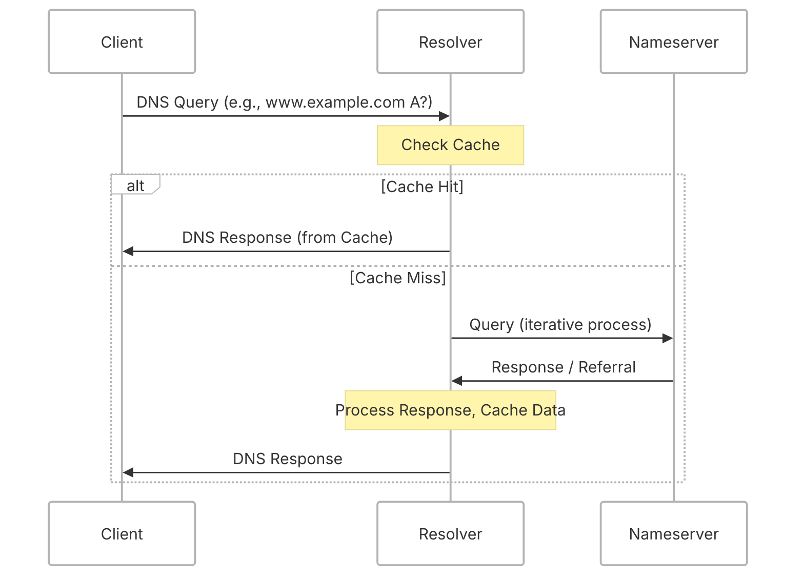
```mermaid
%%{init: {'theme': 'neo', 'themeVariables': { 'fontSize': '44px', 'fontFamily': 'Inter'}}}%%
sequenceDiagram
    participant C as Client
    participant R as Resolver
    participant NS as Nameserver

    C->>R: DNS Query (e.g., www.example.com A?)
    Note over R: Check Cache
    alt Cache Hit
        R->>C: DNS Response (from Cache)
    else Cache Miss
        R->>NS: Query (iterative process)
        NS->>R: Response / Referral
        Note over R: Process Response, Cache Data
        R->>C: DNS Response
    end
```

## DNS Resolver

High level state machine
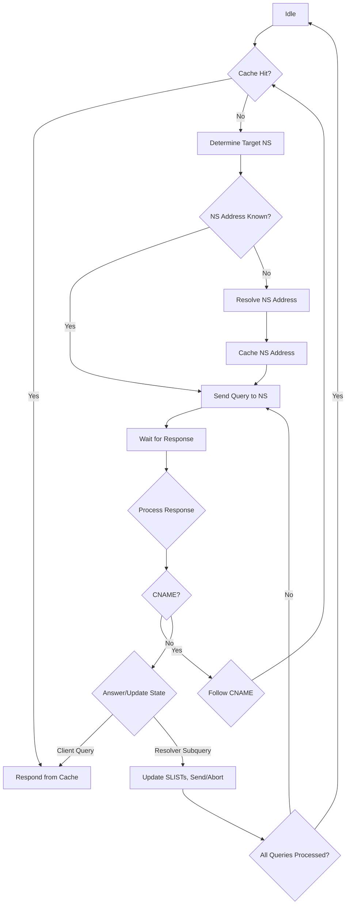
```mermaid
graph TD
    A[Idle] --> B{Cache Hit?}
    B -- Yes --> C[Respond from Cache]
    B -- No --> D[Determine Target NS]
    D --> E{NS Address Known?}
    E -- Yes --> F[Send Query to NS]
    E -- No --> G[Resolve NS Address]
    G --> H[Cache NS Address] --> F[Send Query to NS]
    F --> I[Wait for Response]
    I --> J{Process Response}
    J --> K{CNAME?}
    K -- Yes --> L{Follow CNAME}
    L --> B{Cache Hit?}
    K -- No --> M{Answer/Update State}
    M -- Client Query --> C[Respond from Cache]
    M -- Resolver Subquery --> N[Update SLISTs, Send/Abort]
    N --> O{All Queries Processed?}
    O -- Yes --> A[Idle]
    O -- No --> F[Send Query to NS]
```

Cache check state machine
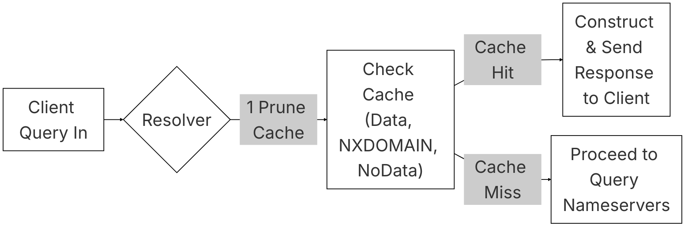
```mermaid
%%{init: {'theme': 'neo', 'themeVariables': { 'fontSize': '44px', 'fontFamily': 'Inter'}}}%%
graph LR
    A[Client Query In] --> B{Resolver};
    B -- "1 Prune Cache" --> C["Check Cache (Data, NXDOMAIN, NoData)"];
    C -- Cache Hit --> D[Construct & Send Response to Client];
    C -- Cache Miss --> E[Proceed to Query Nameservers];
```

Cache miss state machine
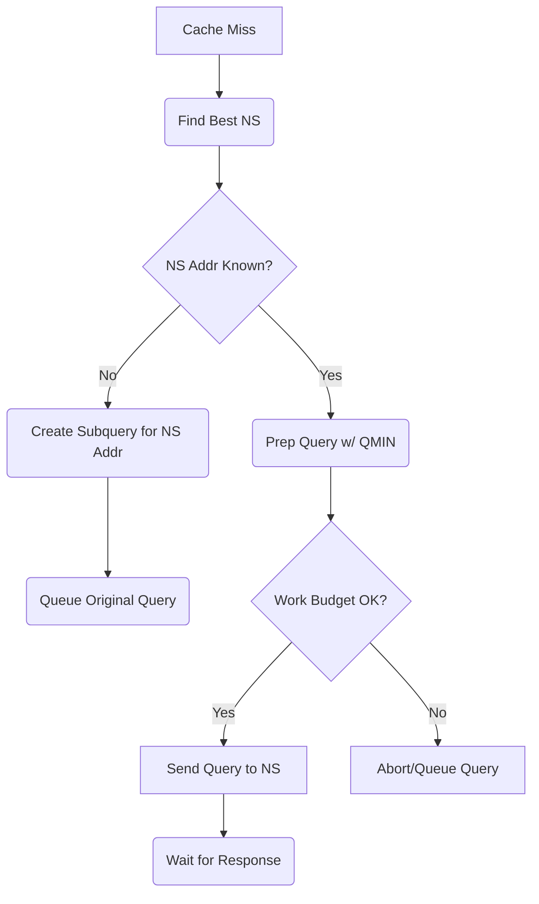
```mermaid
graph TD
    A[Cache Miss] --> B(Find Best NS);
    B --> C{NS Addr Known?};
    C -- Yes --> D(Prep Query w/ QMIN);
    C -- No --> E(Create Subquery for NS Addr);
    E --> F(Queue Original Query);
    D --> G{Work Budget OK?};
    G -- Yes --> H[Send Query to NS];
    G -- No --> I[Abort/Queue Query];
    H --> J(Wait for Response);
```

## Nameserver

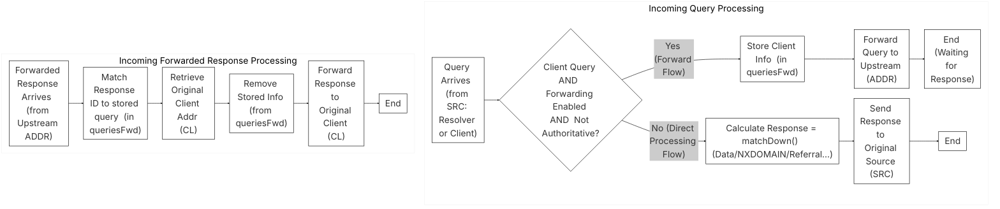
```mermaid
%%{init: {'theme': 'neo', 'themeVariables': { 'fontSize': '44px', 'fontFamily': 'Inter'}}}%%
graph TD
    subgraph "Incoming Query Processing"
        A["Query Arrives  (from SRC: Resolver or Client)"] --> B{"Client Query AND  Forwarding Enabled AND  Not Authoritative?"};
        B -- "Yes (Forward Flow)" --> C["Store Client Info  (in queriesFwd)"];
        C --> D["Forward Query to Upstream (ADDR)"];
        D --> E["End (Waiting for Response)"];

        B -- "No (Direct Processing Flow)" --> F["Calculate Response = matchDown()  (Data/NXDOMAIN/Referral...)"];
        F --> G["Send Response to Original Source (SRC)"];
        G --> H["End"];
    end

    subgraph "Incoming Forwarded Response Processing"
        I["Forwarded Response Arrives  (from Upstream ADDR)"] --> J["Match Response ID to stored query  (in queriesFwd)"];
        J --> K["Retrieve Original Client Addr (CL)"];
        K --> L["Remove Stored Info (from queriesFwd)"];
        L --> M["Forward Response to Original Client (CL)"];
        M --> N["End"];
    end
```

## Scheduler 

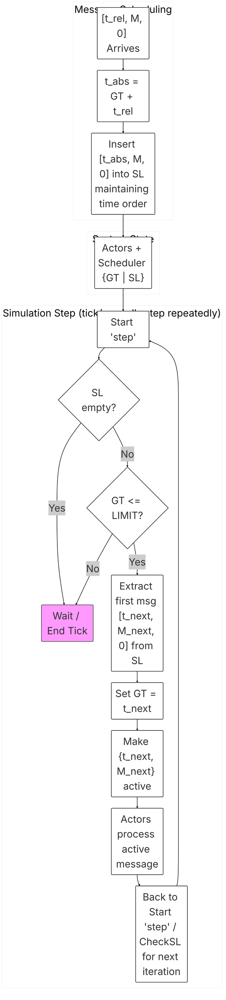
```mermaid
%%{init: {'theme': 'neo', 'themeVariables': { 'fontSize': '44px', 'fontFamily': 'Inter'}}}%%
graph TD
    subgraph "System State"
        State("Actors + Scheduler {GT | SL}")
    end

    subgraph "Message Scheduling"
        NewMsg("[t_rel, M, 0] Arrives") --> CalcTime("t_abs = GT + t_rel");
        CalcTime --> Insert("Insert [t_abs, M, 0] into SL maintaining time order");
        Insert --> State;
    end

    subgraph "Simulation Step (tick/run calls step repeatedly)"
        StartStep("Start 'step'") --> CheckSL{"SL empty?"};
        CheckSL -- "No" --> CheckLimit{"GT <= LIMIT?"};
        CheckSL -- "Yes" --> Stop("Wait / End Tick");
        CheckLimit -- "No" --> Stop;
        CheckLimit -- "Yes" --> Extract("Extract first msg [t_next, M_next, 0] from SL");
        Extract --> AdvanceGT("Set GT = t_next");
        AdvanceGT --> Activate("Make {t_next, M_next} active");
        Activate --> Process("Actors process active message");
        Process --> Loop("Back to Start 'step' / CheckSL for next iteration");
         Loop --> StartStep;
    end

    State --> StartStep;

    style Stop fill:#f9f,stroke:#333,stroke-width:2px
```    

# Iodine Model

Sequence diagram summarizing all the interactions

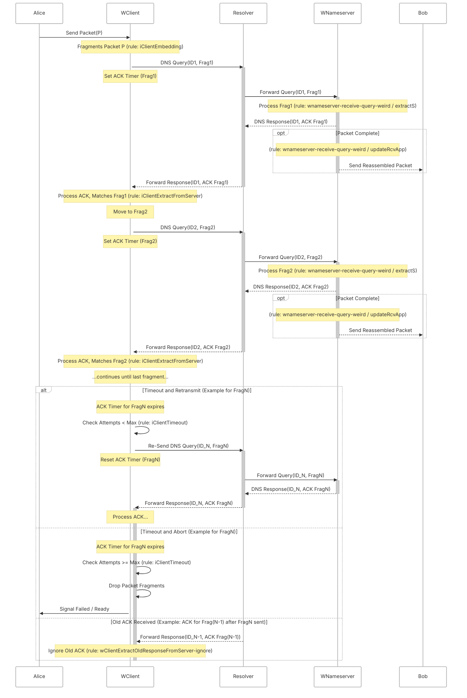
```mermaid
---
config:
  theme: neo
  themeVariables:
    fontSize: 44px
    fontFamily: Inter
  layout: elk
---
sequenceDiagram
    participant Alice
    participant WClient
    participant Resolver
    participant WNameserver
    participant Bob

    Alice ->> WClient: Send Packet(P)
    activate WClient
    Note over WClient: Fragments Packet P (rule: iClientEmbedding)
    WClient ->> Resolver: DNS Query(ID1, Frag1)
    activate Resolver
    Note over WClient: Set ACK Timer (Frag1)
    Resolver ->> WNameserver: Forward Query(ID1, Frag1)
    activate WNameserver
    Note over WNameserver: Process Frag1 (rule: wnameserver-receive-query-weird / extractS)
    WNameserver -->> Resolver: DNS Response(ID1, ACK Frag1)
    opt Packet Complete
        Note over WNameserver: (rule: wnameserver-receive-query-weird / updateRcvApp)
        WNameserver -->> Bob: Send Reassembled Packet
    end
    deactivate WNameserver
    Resolver -->> WClient: Forward Response(ID1, ACK Frag1)
    deactivate Resolver
    activate WClient
    Note over WClient: Process ACK, Matches Frag1 (rule: iClientExtractFromServer)
    Note over WClient: Move to Frag2
    WClient ->> Resolver: DNS Query(ID2, Frag2)
    activate Resolver
    Note over WClient: Set ACK Timer (Frag2)
    Resolver ->> WNameserver: Forward Query(ID2, Frag2)
    activate WNameserver
    Note over WNameserver: Process Frag2 (rule: wnameserver-receive-query-weird / extractS)
    WNameserver -->> Resolver: DNS Response(ID2, ACK Frag2)
    opt Packet Complete
        Note over WNameserver: (rule: wnameserver-receive-query-weird / updateRcvApp)
        WNameserver -->> Bob: Send Reassembled Packet
    end
    deactivate WNameserver
    Resolver -->> WClient: Forward Response(ID2, ACK Frag2)
    deactivate Resolver
    activate WClient
    Note over WClient: Process ACK, Matches Frag2 (rule: iClientExtractFromServer)
    Note over WClient: ...continues until last fragment...

    alt Timeout and Retransmit (Example for FragN)
        Note over WClient: ACK Timer for FragN expires
        WClient ->> WClient: Check Attempts < Max (rule: iClientTimeout)
        WClient ->> Resolver: Re-Send DNS Query(ID_N, FragN)
        activate Resolver
        Note over WClient: Reset ACK Timer (FragN)
        Resolver ->> WNameserver: Forward Query(ID_N, FragN)
        activate WNameserver
        WNameserver -->> Resolver: DNS Response(ID_N, ACK FragN)
        deactivate WNameserver
        Resolver -->> WClient: Forward Response(ID_N, ACK FragN)
        deactivate Resolver
        activate WClient
        Note over WClient: Process ACK...
    else Timeout and Abort (Example for FragN)
        Note over WClient: ACK Timer for FragN expires
        WClient ->> WClient: Check Attempts >= Max (rule: iClientTimeout)
        WClient ->> WClient: Drop Packet Fragments
        WClient ->> Alice: Signal Failed / Ready
    else Old ACK Received (Example: ACK for Frag(N-1) after FragN sent)
        Resolver -->> WClient: Forward Response(ID_N-1, ACK Frag(N-1))
        Note over WClient: Ignore Old ACK (rule: wClientExtractOldResponseFromServer-ignore)
    end
    deactivate WClient
```


## Iodine server

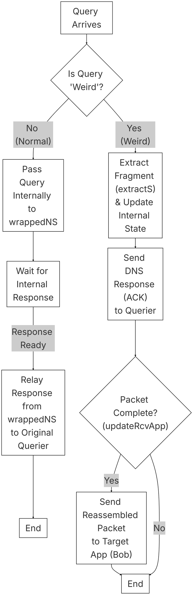
```mermaid
---
config:
  theme: neo
  themeVariables:
    fontSize: 44px
    fontFamily: Inter
  layout: fixed
---
flowchart TD
    A["Query Arrives"] --> B@{ label: "Is Query 'Weird'?" }
    B -- No (Normal) --> C["Pass Query Internally to wrappedNS"]
    C --> D["Wait for Internal Response"]
    D -- Response Ready --> E["Relay Response from wrappedNS to Original Querier"]
    E --> F["End"]
    B -- Yes (Weird) --> G["Extract Fragment (extractS)\n& Update Internal State"]
    G --> H["Send DNS Response (ACK)\nto Querier"]
    H --> I{"Packet Complete?\n(updateRcvApp)"}
    I -- Yes --> J["Send Reassembled Packet\nto Target App (Bob)"]
    J --> K["End"]
    I -- No --> K
    B@{ shape: diamond}
```

## Iodine client

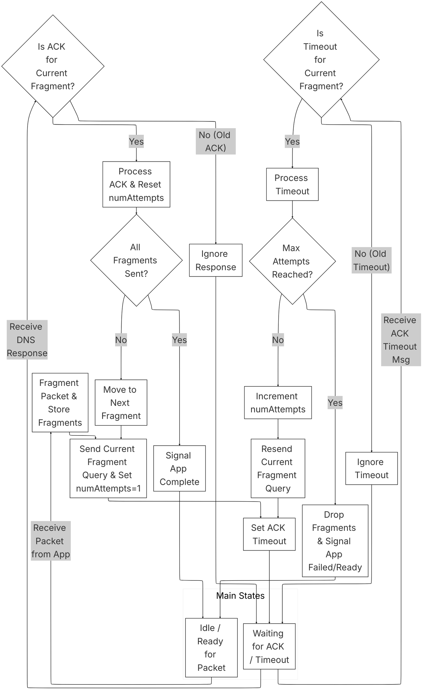
```mermaid
---
config:
  theme: neo
  themeVariables:
    fontSize: 44px
    fontFamily: Inter
  layout: elk
---
flowchart TD
 subgraph subGraph0["Main States"]
        Idle["Idle / Ready for Packet"]
        Waiting["Waiting for ACK / Timeout"]
  end
    Idle -- Receive Packet from App --> FragPkt["Fragment Packet & Store Fragments"]
    FragPkt --> SendFrag["Send Current Fragment Query & Set numAttempts=1"]
    SendFrag --> SetTimeout["Set ACK Timeout"]
    SetTimeout --> Waiting
    Waiting -- Receive DNS Response --> CheckResp{"Is ACK for Current Fragment?"}
    CheckResp -- Yes --> ProcACK["Process ACK & Reset numAttempts"]
    ProcACK --> CheckDone{"All Fragments Sent?"}
    CheckDone -- Yes --> SignalDone["Signal App Complete"]
    SignalDone --> Idle
    CheckDone -- No --> MoveNext["Move to Next Fragment"]
    MoveNext --> SendFrag
    CheckResp -- No (Old ACK) --> IgnoreResp["Ignore Response"]
    IgnoreResp --> Waiting
    Waiting -- Receive ACK Timeout Msg --> CheckTimeout{"Is Timeout for Current Fragment?"}
    CheckTimeout -- Yes --> ProcTimeout["Process Timeout"]
    ProcTimeout --> CheckAttempts{"Max Attempts Reached?"}
    CheckAttempts -- Yes --> DropPkt["Drop Fragments & Signal App Failed/Ready"]
    DropPkt --> Idle
    CheckAttempts -- No --> IncAttempts["Increment numAttempts"]
    IncAttempts --> ResendFrag["Resend Current Fragment Query"]
    ResendFrag --> SetTimeout
    CheckTimeout -- No (Old Timeout) --> IgnoreTimeout["Ignore Timeout"]
    IgnoreTimeout --> Waiting
```
## Send app (Alice)

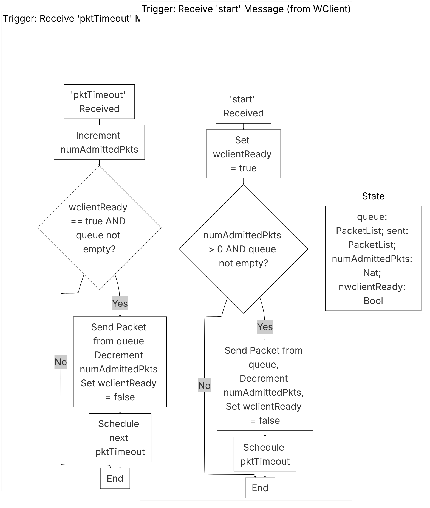
```mermaid
---
config:
  theme: neo
  themeVariables:
    fontSize: 44px
    fontFamily: Inter
  layout: elk
---
graph TD
    subgraph "State"
        S["queue: PacketList; sent: PacketList; numAdmittedPkts: Nat; nwclientReady: Bool"]
    end

    subgraph "Trigger: Receive 'start' Message (from WClient)"
        T1_Start["'start' Received"] --> T1_SetReady["Set wclientReady = true"];
        T1_SetReady --> T1_Check{"numAdmittedPkts > 0 AND queue not empty?"};
        T1_Check -- "Yes" --> T1_Send["Send Packet from queue, Decrement numAdmittedPkts, Set wclientReady = false"];
        T1_Send --> T1_SetTimeout["Schedule pktTimeout"];
        T1_SetTimeout --> T1_End["End"];
        T1_Check -- "No" --> T1_End;
    end

    subgraph "Trigger: Receive 'pktTimeout' Message (Self)"
        T2_Start["'pktTimeout' Received"] --> T2_IncPkts["Increment numAdmittedPkts"];
        T2_IncPkts --> T2_Check{"wclientReady == true AND queue not empty?"};
        T2_Check -- "Yes" --> T2_Send["Send Packet from queue Decrement numAdmittedPkts Set wclientReady = false"];
        T2_Send --> T2_SetTimeout["Schedule next pktTimeout"];
        T2_SetTimeout --> T2_End["End"];
        T2_Check -- "No" --> T2_End;
    end
```

## Receive App

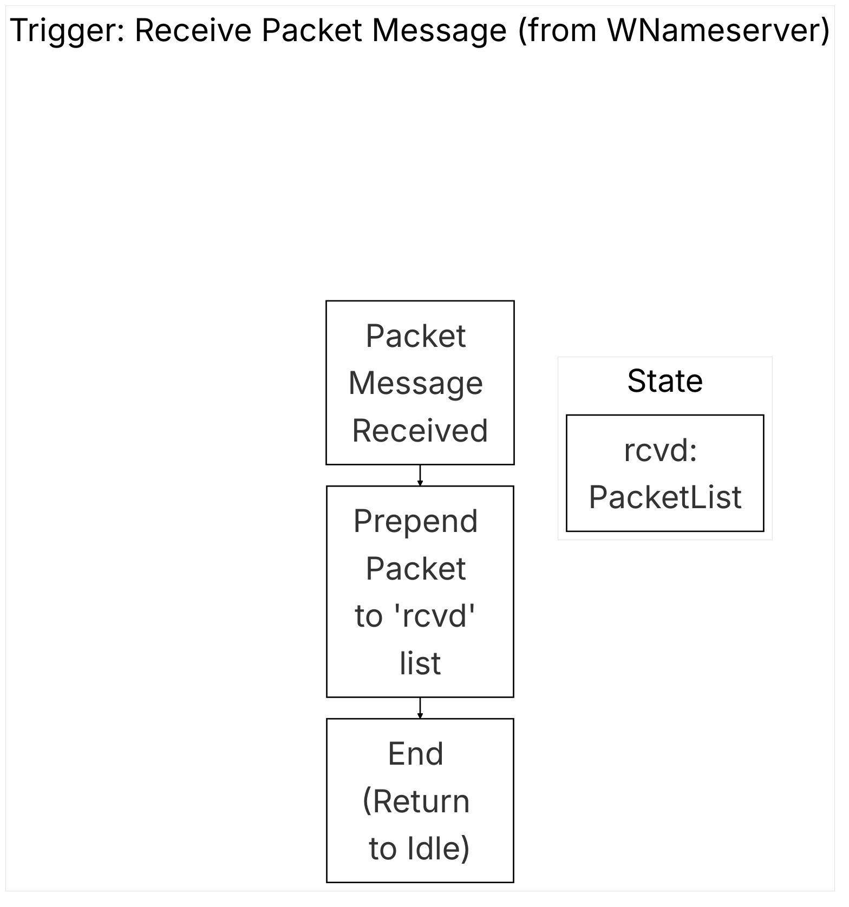
```mermaid
---
config:
  theme: neo
  themeVariables:
    fontSize: 44px
    fontFamily: Inter
  layout: elk
---
graph TD
    subgraph "State"
        S["rcvd: PacketList"]
    end

    subgraph "Trigger: Receive Packet Message (from WNameserver)"
        T1_Start["Packet Message Received"] --> T1_Store["Prepend Packet to 'rcvd' list"];
        T1_Store --> T1_End["End (Return to Idle)"];
    end
```

# Adversary

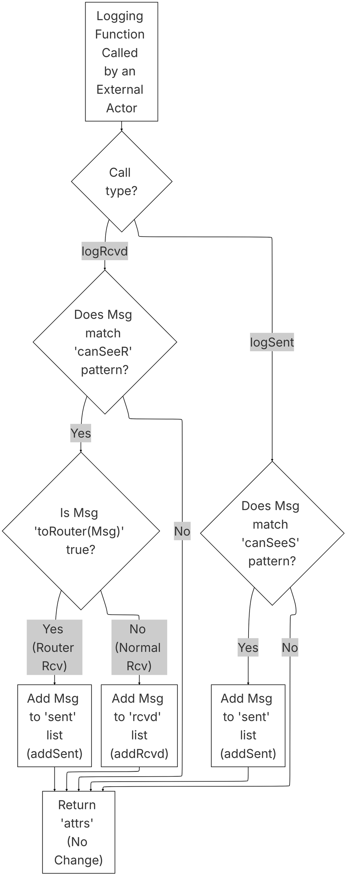
```mermaid
---
config:
  theme: neo
  themeVariables:
    fontSize: 44px
    fontFamily: Inter
  layout: elk
---
graph TD
    A["Logging Function Called by an External Actor"] --> B{Call type?};

    B -- "logRcvd" --> C{"Does Msg match 'canSeeR' pattern?"};
    C -- "No" --> End["Return 'attrs' (No Change)"];
    C -- "Yes" --> D{"Is Msg 'toRouter(Msg)' true?"};
    D -- "Yes (Router Rcv)" --> E["Add Msg to 'sent' list<br>(addSent)"];
    D -- "No (Normal Rcv)" --> F["Add Msg to 'rcvd' list<br>(addRcvd)"];
    E --> End;
    F --> End;
    
    B -- "logSent" --> G{"Does Msg match 'canSeeS' pattern?"};
    G -- "No" --> End;
    G -- "Yes" --> H["Add Msg to 'sent' list<br>(addSent)"];
    H --> End;
```

# Raceboat Model

## Raceboat Client

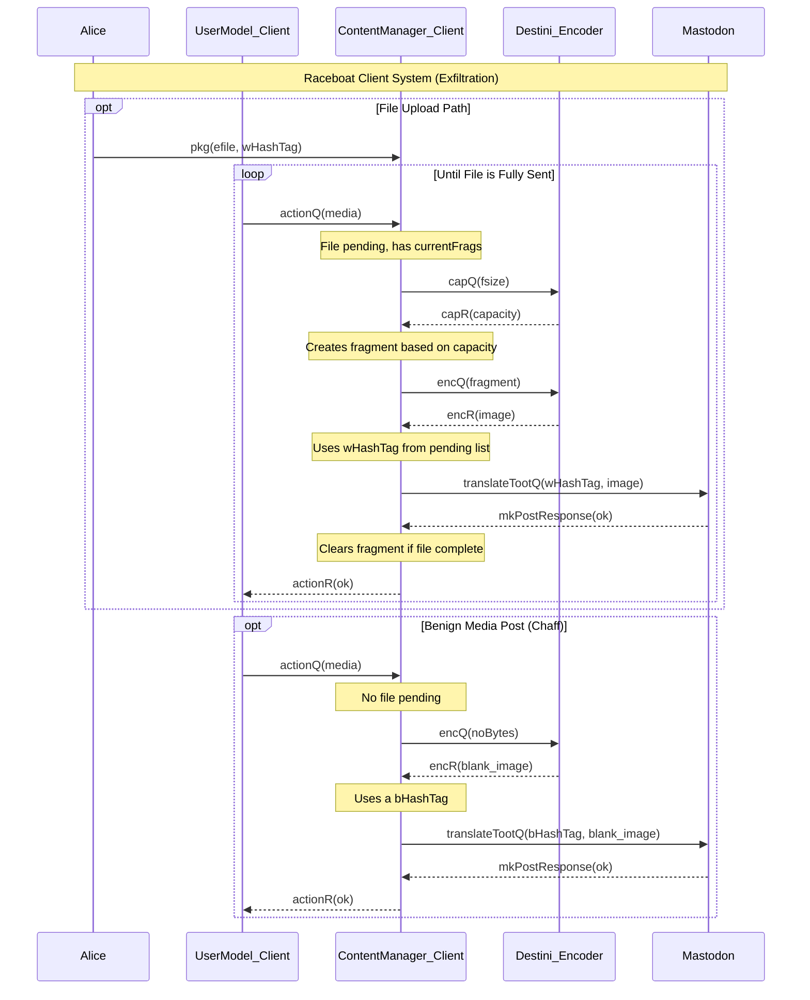
```mermaid
sequenceDiagram
    participant Alice
    participant UMC as UserModel_Client
    participant CMC as ContentManager_Client
    participant EDC as Destini_Encoder
    participant Mastodon

    Note over Alice, Mastodon: Raceboat Client System (Exfiltration)

    opt File Upload Path
        Alice ->> CMC: pkg(efile, wHashTag)
        
        loop Until File is Fully Sent
            UMC ->> CMC: actionQ(media)
            Note over CMC: File pending, has currentFrags
            CMC ->> EDC: capQ(fsize)
            EDC -->> CMC: capR(capacity)
            Note over CMC: Creates fragment based on capacity
            CMC ->> EDC: encQ(fragment)
            EDC -->> CMC: encR(image)
            Note over CMC: Uses wHashTag from pending list
            CMC ->> Mastodon: translateTootQ(wHashTag, image)
            Mastodon -->> CMC: mkPostResponse(ok)
            Note over CMC: Clears fragment if file complete
            CMC -->> UMC: actionR(ok)
        end
    end
    
    opt Benign Media Post (Chaff)
        UMC ->> CMC: actionQ(media)
        Note over CMC: No file pending
        CMC ->> EDC: encQ(noBytes)
        EDC -->> CMC: encR(blank_image)
        Note over CMC: Uses a bHashTag
        CMC ->> Mastodon: translateTootQ(bHashTag, blank_image)
        Mastodon -->> CMC: mkPostResponse(ok)
        CMC -->> UMC: actionR(ok)
    end
```

## Raceboat Server

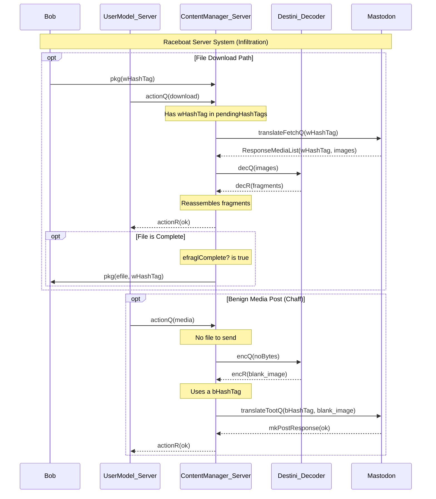
```mermaid
sequenceDiagram
    participant Bob
    participant UMS as UserModel_Server
    participant CMS as ContentManager_Server
    participant EDS as Destini_Decoder
    participant Mastodon

    Note over Bob, Mastodon: Raceboat Server System (Infiltration)

    opt File Download Path
        Bob ->> CMS: pkg(wHashTag)
        
        UMS ->> CMS: actionQ(download)
        Note over CMS: Has wHashTag in pendingHashTags
        CMS ->> Mastodon: translateFetchQ(wHashTag)
        Mastodon -->> CMS: ResponseMediaList(wHashTag, images)
        CMS ->> EDS: decQ(images)
        EDS -->> CMS: decR(fragments)
        Note over CMS: Reassembles fragments
        CMS -->> UMS: actionR(ok)
        
        opt File is Complete
            Note over CMS: efraglComplete? is true
            CMS ->> Bob: pkg(efile, wHashTag)
        end
    end
    
    opt Benign Media Post (Chaff)
        UMS ->> CMS: actionQ(media)
        Note over CMS: No file to send
        CMS ->> EDS: encQ(noBytes)
        EDS -->> CMS: encR(blank_image)
        Note over CMS: Uses a bHashTag
        CMS ->> Mastodon: translateTootQ(bHashTag, blank_image)
        Mastodon -->> CMS: mkPostResponse(ok)
        CMS -->> UMS: actionR(ok)
    end
```

## Markov Actors
As a sequence diagram orchestrating an external actor
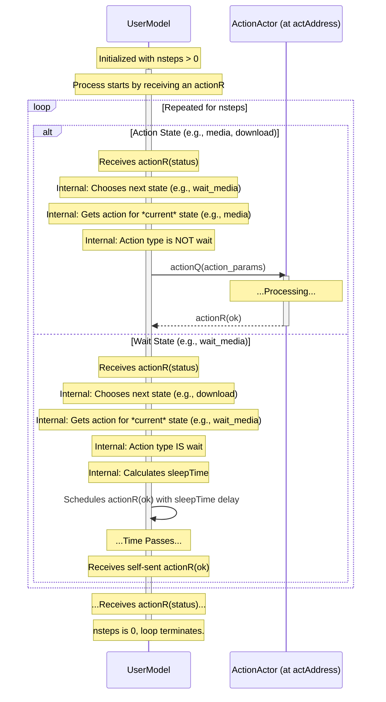
```mermaid
sequenceDiagram
    participant UserModel
    participant ActionActor as ActionActor (at actAddress)

    Note over UserModel: Initialized with nsteps > 0
    activate UserModel

    Note over UserModel: Process starts by receiving an actionR
    loop Repeated for nsteps
        
        alt Action State (e.g., media, download)
            Note over UserModel: Receives actionR(status)
            Note over UserModel: Internal: Chooses next state (e.g., wait_media)
            Note over UserModel: Internal: Gets action for *current* state (e.g., media)
            Note over UserModel: Internal: Action type is NOT wait
            UserModel ->> ActionActor: actionQ(action_params)
            activate ActionActor
            
            Note over ActionActor: ...Processing...
            ActionActor -->> UserModel: actionR(ok)
            deactivate ActionActor
        
        else Wait State (e.g., wait_media)
            Note over UserModel: Receives actionR(status)
            Note over UserModel: Internal: Chooses next state (e.g., download)
            Note over UserModel: Internal: Gets action for *current* state (e.g., wait_media)
            Note over UserModel: Internal: Action type IS wait
            Note over UserModel: Internal: Calculates sleepTime
            
            UserModel ->> UserModel: Schedules actionR(ok) with sleepTime delay
            
            Note over UserModel: ...Time Passes...
            Note over UserModel: Receives self-sent actionR(ok)
        end
    end

    Note over UserModel: ...Receives actionR(status)...
    Note over UserModel: nsteps is 0, loop terminates.
    deactivate UserModel
```
## DNSTgen

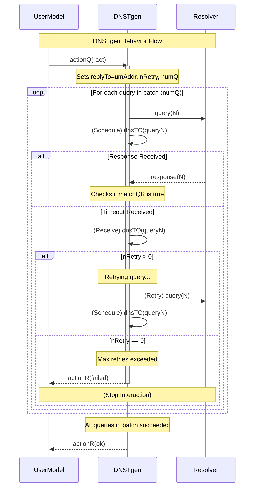
```mermaid
sequenceDiagram
    participant UserModel
    participant DNSTgen
    participant Resolver

    Note over UserModel, Resolver: DNSTgen Behavior Flow
    
    UserModel ->> DNSTgen: actionQ(ract)
    activate DNSTgen
    
    Note over DNSTgen: Sets replyTo=umAddr, nRetry, numQ
    
    loop For each query in batch (numQ)
        DNSTgen ->> Resolver: query(N)
        DNSTgen ->> DNSTgen: (Schedule) dnsTO(queryN)

        alt Response Received
            Resolver -->> DNSTgen: response(N)
            Note over DNSTgen: Checks if matchQR is true
            
        else Timeout Received
            DNSTgen ->> DNSTgen: (Receive) dnsTO(queryN)
            
            alt nRetry > 0
                Note over DNSTgen: Retrying query...
                DNSTgen ->> Resolver: (Retry) query(N)
                DNSTgen ->> DNSTgen: (Schedule) dnsTO(queryN)
                
            else nRetry == 0
                Note over DNSTgen: Max retries exceeded
                DNSTgen -->> UserModel: actionR(failed)
                deactivate DNSTgen
                Note over UserModel, Resolver: (Stop Interaction)
            end
        end
    end
    
    Note over DNSTgen: All queries in batch succeeded
    DNSTgen -->> UserModel: actionR(ok)
    
```

This is an example markov model used by the UM actor to orchestrate DNSTgen
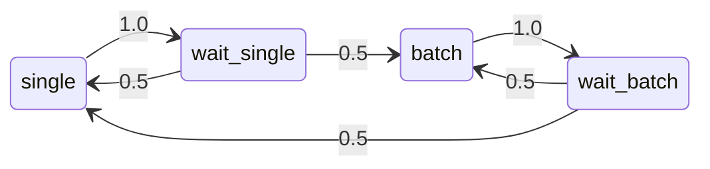
```mermaid
stateDiagram-v2
    direction LR

    state single
    state batch
    state wait_single
    state wait_batch

    single --> wait_single : 1.0
    batch --> wait_batch : 1.0
    
    wait_single --> single : 0.5
    wait_single --> batch : 0.5

    wait_batch --> single : 0.5
    wait_batch --> batch : 0.5
```

# Mastodon

## Mastodon Client / Server Media flow

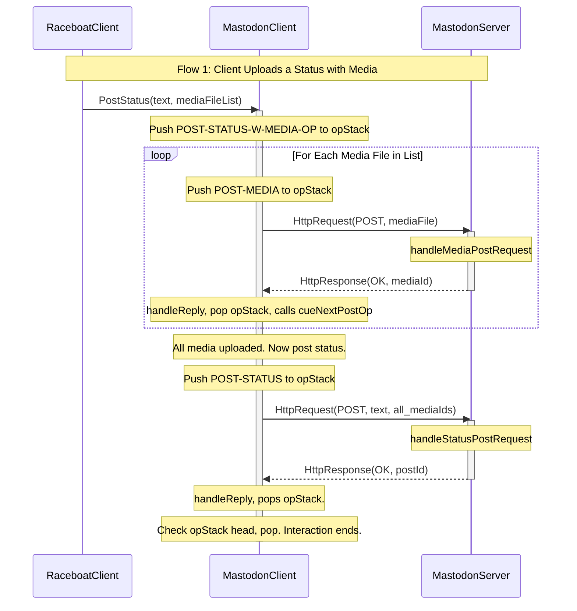
```mermaid
sequenceDiagram
    participant RaceboatClient
    participant MastodonClient
    participant MastodonServer

    Note over RaceboatClient, MastodonServer: Flow 1: Client Uploads a Status with Media

    RaceboatClient ->> MastodonClient: PostStatus(text, mediaFileList)
    activate MastodonClient

    Note over MastodonClient: Push POST-STATUS-W-MEDIA-OP to opStack

    loop For Each Media File in List
        Note over MastodonClient: Push POST-MEDIA to opStack
        MastodonClient ->> MastodonServer: HttpRequest(POST, mediaFile)
        activate MastodonServer
        Note over MastodonServer: handleMediaPostRequest
        MastodonServer -->> MastodonClient: HttpResponse(OK, mediaId)
        deactivate MastodonServer
        Note over MastodonClient: handleReply, pop opStack, calls cueNextPostOp
    end

    Note over MastodonClient: All media uploaded. Now post status.
    Note over MastodonClient: Push POST-STATUS to opStack
    MastodonClient ->> MastodonServer: HttpRequest(POST, text, all_mediaIds)
    activate MastodonServer
    Note over MastodonServer: handleStatusPostRequest
    MastodonServer -->> MastodonClient: HttpResponse(OK, postId)
    deactivate MastodonServer

    Note over MastodonClient: handleReply, pops opStack.
    Note over MastodonClient: Check opStack head, pop. Interaction ends.
    deactivate MastodonClient
```

## Mastodon Client/Server Fetch flow

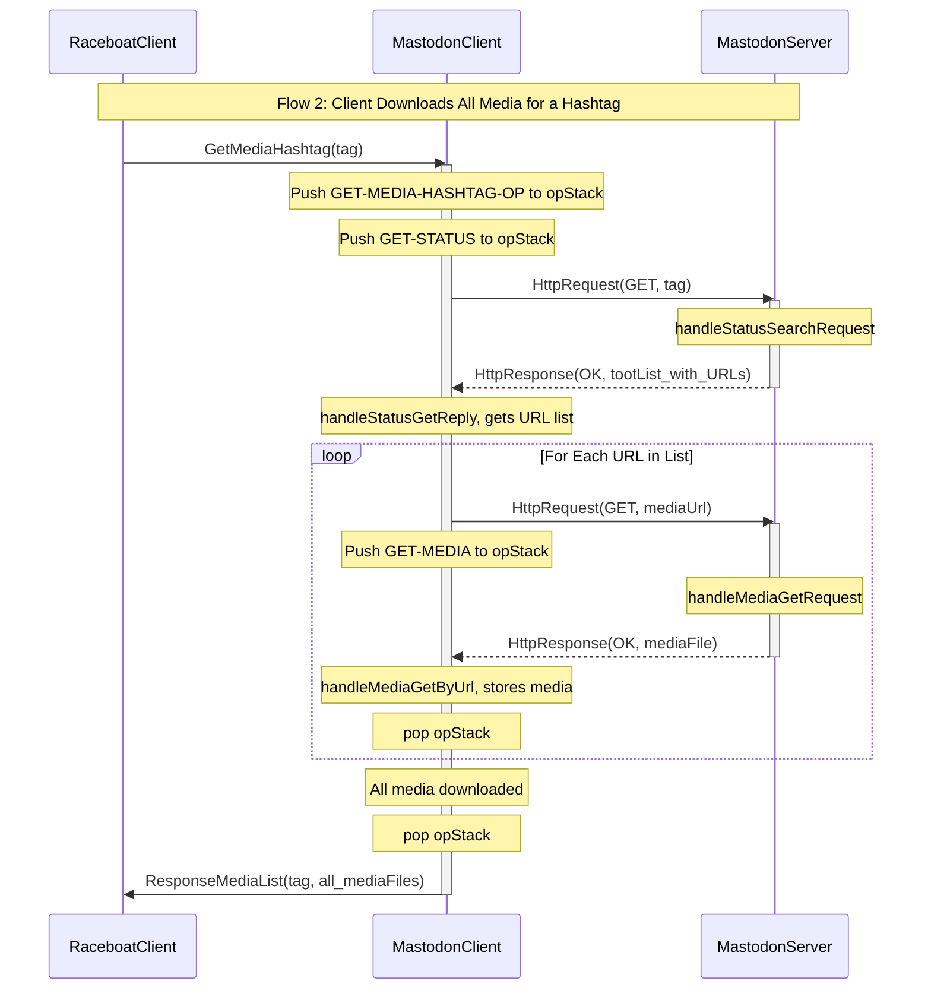
```mermaid
sequenceDiagram
    participant RaceboatClient
    participant MastodonClient
    participant MastodonServer

    Note over RaceboatClient, MastodonServer: Flow 2: Client Downloads All Media for a Hashtag

    RaceboatClient ->> MastodonClient: GetMediaHashtag(tag)
    activate MastodonClient

    Note over MastodonClient: Push GET-MEDIA-HASHTAG-OP to opStack
    Note over MastodonClient: Push GET-STATUS to opStack
    MastodonClient ->> MastodonServer: HttpRequest(GET, tag)
    activate MastodonServer
    Note over MastodonServer: handleStatusSearchRequest
    MastodonServer -->> MastodonClient: HttpResponse(OK, tootList_with_URLs)
    deactivate MastodonServer

    Note over MastodonClient: handleStatusGetReply, gets URL list

    loop For Each URL in List
        MastodonClient ->> MastodonServer: HttpRequest(GET, mediaUrl)
        activate MastodonServer
        Note over MastodonClient: Push GET-MEDIA to opStack
        Note over MastodonServer: handleMediaGetRequest
        MastodonServer -->> MastodonClient: HttpResponse(OK, mediaFile)
        deactivate MastodonServer
        Note over MastodonClient: handleMediaGetByUrl, stores media
        Note over MastodonClient: pop opStack
    end

    Note over MastodonClient: All media downloaded
    Note over MastodonClient: pop opStack
    MastodonClient ->> RaceboatClient: ResponseMediaList(tag, all_mediaFiles)
    deactivate MastodonClient
```
